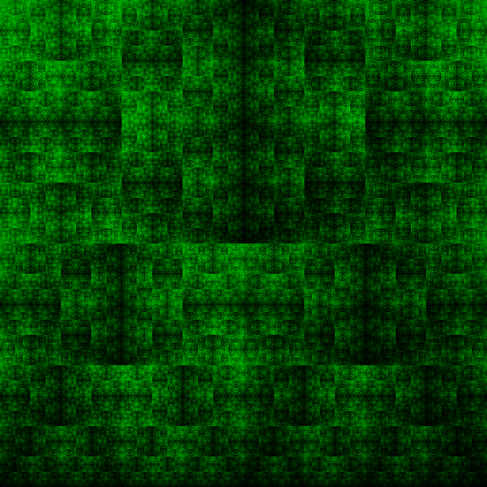

# sat-art
Image visualizations of SAT formulas using Hilbert curve projections.



## Compiling and Running:

The default build target compiles for a linux system, though it should not be difficult to modify the Makefile to work for Windows or macOS.

### Linux

First, be sure that you have GNU make and the g++ compiler installed.  
To compile, run the `make` command in the project directory. The binary will be built in the `bin` directory.

## Running SAT Art:

To generate a default SAT sentence visualization, invoke the compiled executable in the `bin` directory:
```
./bin/sat_art --random
```

The executable is controlled entirely through command line arguments. The full usage of the executable is given below:
```
sat_art [-b beta] ( -f dimacs_file | --random [-c n_clauses] [-v n_vars] 
	[-s seed] [-o dimacs_file_out] ) [img_out]

    -b beta                                                                     
        The rate of decay of the image shader (must be greater than 0.0).       
                                                                                
    -f dimacs_file                                                              
        A dimacs (.cnf) file to read a sentence from. Note that if the sentence 
        is too large, one the first few variables will be evaluated.            
                                                                                
    --random                                                                    
        Generates a random sentence instead of reading from a DIMACS file.      
                                                                                
    -c n_clauses                                                                
        The number of clauses in the randomly generated sentence.               
                                                                                
    -v n_vars                                                                   
        The number of variables in the randomly generated sentence.             
                                                                                
    -s seed                                                                     
        A seed string for the randomly generated sentence.                      
                                                                                
    -o dimacs_file_out                                                          
        An output dimacs (.cnf) file to save a randomly generated sentence.     
                                                                                
    img_out                                                                     
        The output image (optional)
```

## Dependencies

This project uses the [CImg library](https://cimg.eu/), which is a self-contained library used for rendering and viewing images. The code for this library is entirely contained in the `cimg` directory, so nothing additional needs to be installed.
